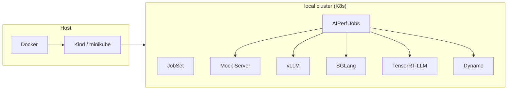
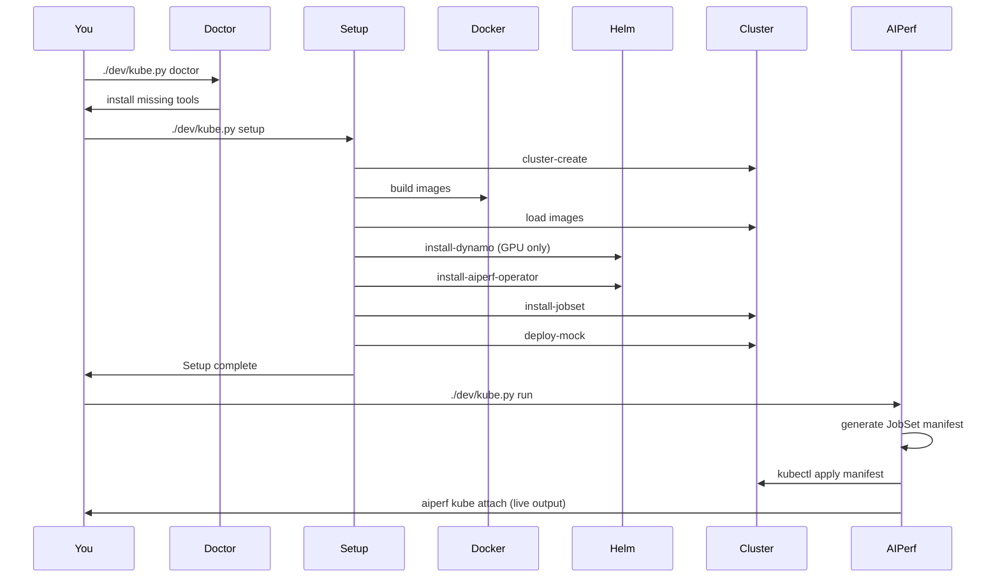

# AIPerf Local Kubernetes Development Suite

```
       ░▒▓ █▀█ █ █▀█ █▀▀ █▀█ █▀▀ ▓▒░
    ░░▒▒▓▓ █▀█ █ █▀▀ ██▄ █▀▄ █▀  ▓▓▒▒░░

         From prefill to production.
 Kind · Minikube · Docker · GPU · Mock · vLLM · SGLang · TensorRT-LLM · Dynamo
```

Python CLI (`kube.py`) for building and running AIPerf in a local **Kind** or **minikube** cluster. Handles cluster lifecycle, image building, and server deployment. Benchmarks are deployed via AIPerf's Kubernetes runner and managed with `aiperf kube` commands. Run directly from the project root.

The cluster runtime is chosen automatically: **minikube** when `nvidia-smi` is on `PATH` (simpler GPU passthrough), **Kind** otherwise. Force one with `CLUSTER_RUNTIME=kind` or `CLUSTER_RUNTIME=minikube`.

---

## Quick start (copy-paste)

From the **project root**:

```bash
# 1. Install anything missing (docker, kind/minikube, kubectl, helm, k9s)
./dev/kube.py doctor

# 2. Full setup: cluster + images + Dynamo operator (GPU only) + AIPerf operator + JobSet + mock server
./dev/kube.py setup

# 3. Run a benchmark (attached)
./dev/kube.py run
```

Or in one line after doctor:

```bash
./dev/kube.py setup && ./dev/kube.py run
```

**Teardown when done:**

```bash
./dev/kube.py teardown
```

---

## Prerequisites

| Tool      | Purpose                          |
|-----------|----------------------------------|
| **Docker** | Container runtime (Docker Desktop on Mac) |
| **kind** *or* **minikube** | Local Kubernetes cluster — whichever the effective runtime selects |
| **kubectl** | Kubernetes CLI                  |
| **helm**  | Install Dynamo / AIPerf operators  |
| **uv**    | Run AIPerf CLI (`run` generates manifests and attaches via `aiperf kube`) |

Doctor's required set is `docker`, `kubectl`, `helm`, plus `kind` or `minikube` depending on the effective runtime. `uv` is not part of that check — `run` verifies it separately before attaching.

**Optional:** **k9s** — terminal UI for the cluster (doctor can install it).

Run **`./dev/kube.py doctor`** to check what's installed and interactively install missing tools (with platform-specific recipes for macOS, Arch, Debian/Ubuntu, Fedora, and generic Linux).

---

## Architecture



**Setup pipeline:**



---

## Command reference

### Workflow

| Command                        | Description |
|--------------------------------|-------------|
| `./dev/kube.py doctor`         | Check prerequisites; interactively install missing tools (docker, kind/minikube, kubectl, helm, k9s). |
| `./dev/kube.py setup`          | Full setup: cluster + build images + load + Dynamo operator (GPU only) + AIPerf operator + JobSet + mock server. Skip steps with `-D/--no-dynamo`, `-J/--no-jobset`, `-M/--no-mock`. |
| `./dev/kube.py teardown`       | Clean up AIPerf namespaces, then delete the entire local cluster. |
| `./dev/kube.py status`         | Show cluster status (runtime, images, GPU, Dynamo, vLLM, benchmarks). |
| `./dev/kube.py reload`         | Rebuild AIPerf image and load it into the cluster (fast iteration). |

### Inference servers

| Command                        | Description |
|--------------------------------|-------------|
| `./dev/kube.py deploy-mock`    | Deploy mock LLM server (no GPU). |
| `./dev/kube.py remove-mock`    | Remove mock server. |
| `./dev/kube.py deploy-vllm`    | Deploy standalone vLLM server (GPU). |
| `./dev/kube.py remove-vllm`    | Remove vLLM server. |
| `./dev/kube.py vllm-logs`      | View vLLM logs (`--follow` to stream). |
| `./dev/kube.py deploy-sglang`  | Deploy standalone SGLang server (GPU). |
| `./dev/kube.py remove-sglang`  | Remove SGLang server. |
| `./dev/kube.py sglang-logs`    | View SGLang logs (`--follow` to stream). |
| `./dev/kube.py deploy-trtllm`  | Deploy standalone TensorRT-LLM server (GPU). |
| `./dev/kube.py remove-trtllm`  | Remove TensorRT-LLM server. |
| `./dev/kube.py trtllm-logs`    | View TensorRT-LLM logs (`--follow` to stream). |
| `./dev/kube.py deploy-dynamo`  | Deploy Dynamo inference server (agg / disagg / disagg-1gpu). |
| `./dev/kube.py remove-dynamo`  | Remove Dynamo server. |
| `./dev/kube.py dynamo-logs`    | View Dynamo pod logs (`--follow` to stream). |
| `./dev/kube.py deploy-lora`    | Deploy LoRA adapter on running Dynamo base model. |
| `./dev/kube.py remove-lora`    | Remove LoRA adapter. |

### Benchmark (distributed — JobSet)

| Command                        | Description |
|--------------------------------|-------------|
| `./dev/kube.py run`            | Generate manifest, deploy benchmark, and attach via `aiperf kube attach`. |
| `./dev/kube.py run-detach`     | Generate manifest, deploy benchmark in background (prints job ID for follow-up). |
| `./dev/kube.py dry-run`        | Print generated benchmark manifest only (no apply). |

After `run-detach`, use the printed job ID with `aiperf kube` commands:

```bash
uv run aiperf kube list <job_id> --watch  # watch benchmark status
uv run aiperf kube logs <job_id>      # view benchmark logs
uv run aiperf kube attach <job_id>    # re-attach to running benchmark
uv run aiperf kube results <job_id>   # view results after completion
```

### Benchmark (single-pod — no JobSet)

| Command                             | Description |
|-------------------------------------|-------------|
| `./dev/kube.py run-local`           | Deploy single-pod benchmark and attach via `kubectl logs`. |
| `./dev/kube.py run-local-detach`    | Deploy single-pod benchmark in background. |
| `./dev/kube.py dry-run-local`       | Print single-pod manifest only (no apply). |

All AIPerf services run as subprocesses in one container (MULTIPROCESSING mode, ZMQ IPC). No JobSet CRD required.

These variants take **no** `--config` / `--workers-max` options. They run `aiperf profile` directly, so every AIPerf argument is passed after `--`, and `--url` is injected automatically pointing at the in-cluster mock server:

```bash
./dev/kube.py run-local -- --model mock --endpoint-type chat --concurrency 4
```

Omitting the `--` arguments is an error.

### Low-level

| Command                           | Description |
|-----------------------------------|-------------|
| `./dev/kube.py cluster-create`    | Create the local cluster only (Kind or minikube; GPU wiring if nvidia-smi present). |
| `./dev/kube.py cluster-delete`    | Delete the local cluster. |
| `./dev/kube.py install-dynamo`    | Install Dynamo operator (Helm from NGC). |
| `./dev/kube.py install-aiperf-operator` | Install the AIPerf operator from the local Helm chart. |
| `./dev/kube.py install-jobset`    | Install JobSet controller. |
| `./dev/kube.py install-kueue`     | Install Kueue plus a default ResourceFlavor / ClusterQueue / LocalQueue. |
| `./dev/kube.py remove-kueue`      | Remove Kueue and the default queues. |
| `./dev/kube.py install-prometheus` | Install kube-prometheus-stack (Prometheus + Grafana). |
| `./dev/kube.py install-loki`      | Install loki-stack (Loki + Promtail). |
| `./dev/kube.py build`             | Build AIPerf + mock Docker images. |
| `./dev/kube.py load`              | Load images into the cluster. |
| `./dev/kube.py push`              | Retag and `docker push` the AIPerf image to a remote registry (`--registry`/`-r`, `--tag`/`-t`). |
| `./dev/kube.py cleanup`           | Remove AIPerf benchmark namespaces and orphaned JobSets (keep cluster). |
| `./dev/kube.py logs`              | View AIPerf benchmark pod logs. |

---

## Options and variables

### Benchmark (`run`, `run-detach`, `dry-run`)

| Flag                   | Default                                | Description |
|------------------------|----------------------------------------|-------------|
| `--config` / `-c`     | `CONFIG` env, else `dev/deploy/test-benchmark-config.yaml` | Benchmark config file (path from project root). |
| `--workers-max` / `-w` | `WORKERS` env, else `min(docker CPUs, 10)` | Maximum number of workers. |

Every command also accepts `--json` (structured stdout, suppresses the banner) and `--yes` / `-y` (auto-accept confirmations).

**Examples:**

```bash
./dev/kube.py run -c my.yaml -w 20                          # distributed (JobSet)
./dev/kube.py run-local -- --model mock --endpoint-type chat  # single-pod (no JobSet)
./dev/kube.py dry-run-local -- --model mock                 # preview single-pod manifest
```

### Logs

| Flag                    | Default              | Description |
|-------------------------|----------------------|-------------|
| `--namespace` / `-n`   | `NS` env, else auto-detect | Namespace for `logs`. |
| `--pod` / `-p`         | `POD` env, else `controller` | Pod name filter, e.g. `controller`, `worker-N`, or `all`. |
| `--follow` / `-f`      | `FOLLOW` env, else false | Stream logs. |

```bash
./dev/kube.py logs --follow
./dev/kube.py logs --pod all
./dev/kube.py vllm-logs --follow
```

### Cluster and images

| Variable              | Default              | Description |
|-----------------------|----------------------|-------------|
| `CLUSTER_NAME`        | `aiperf`             | Kind cluster / minikube profile name. |
| `CLUSTER_RUNTIME`     | `minikube` with GPU, `kind` without | Force the cluster runtime (`kind` or `minikube`). |
| `AIPERF_IMAGE`        | `aiperf:local`       | AIPerf Docker image. |
| `MOCK_SERVER_IMAGE`   | `aiperf-mock-server:latest` | Mock server image. |
| `JOBSET_VERSION`      | `v0.8.0`             | JobSet controller version. |
| `DEVICE_PLUGIN_VERSION` | `v0.17.0`          | NVIDIA device plugin version. |
| `MINIKUBE_MEMORY`     | 75% of Docker memory, capped at `16000mb` | Minikube memory. |
| `MINIKUBE_CPUS`       | `min(docker CPUs, 8)` | Minikube CPUs. |

Pinned versions live in `dev/versions.py`, which is the shared source of truth for `dev/kube.py` and the Kubernetes test fixtures.

### vLLM (deploy-vllm)

| Flag / variable                          | Default                      | Description |
|------------------------------------------|------------------------------|-------------|
| `--model` / `-m` / `MODEL`              | `Qwen/Qwen3-0.6B`            | Model name. |
| `--gpus` / `-g` / `GPUS`                | `1`                          | GPUs per instance. |
| `--vllm-image` / `VLLM_IMAGE`           | `vllm/vllm-openai:latest`    | vLLM image. |
| `--max-model-len` / `MAX_MODEL_LEN`     | `4096`                       | Max context length. |
| `GPU_MEM_UTIL`                           | `0.5`                        | GPU memory utilization (0–1). |
| `HF_TOKEN`                               | —                            | Hugging Face token (gated models). |

`deploy-sglang` and `deploy-trtllm` take the same `--model` / `--gpus` / `--max-model-len` options, plus `--sglang-image` (`SGLANG_IMAGE`, default `lmsysorg/sglang:latest`) and `--trtllm-image` (`TRTLLM_IMAGE`, default `nvcr.io/nvidia/tensorrt-llm/release:1.3.0rc7`).

### Dynamo (deploy-dynamo)

| Flag / variable                                  | Default   | Description |
|--------------------------------------------------|-----------|-------------|
| `--mode` / `DYNAMO_MODE`                        | `agg`     | `agg`, `disagg`, or `disagg-1gpu`. |
| `--dynamo-image` / `DYNAMO_IMAGE`               | `nvcr.io/nvidia/ai-dynamo/vllm-runtime:1.3.0` | Dynamo runtime image. |
| `DYNAMO_VERSION`                                  | `1.3.0`   | Dynamo operator version. |
| `DYNAMO_1GPU_MEM_UTIL`                            | `0.3`     | GPU memory util for single-GPU disagg. |
| `--router-mode` / `DYNAMO_ROUTER_MODE`           | —         | e.g. `kv`, `round-robin`. |
| `--kvbm-cpu-cache-gb` / `DYNAMO_KVBM_CPU_CACHE_GB` | —      | KVBM CPU cache (GB). |
| `--connectors` / `DYNAMO_CONNECTORS`             | —         | Flag takes a space-separated list (`--connectors kvbm nixl`); the env var is comma-separated (`kvbm,nixl`). Use `--empty-connectors` to force an empty list. |

`deploy-dynamo` also accepts `--model` / `-m`, `--gpus` / `-g`, and `--max-model-len`.

### LoRA (deploy-lora / remove-lora)

| Flag                  | Description |
|-----------------------|-------------|
| `--name`              | LoRA adapter name (required by both commands). |
| `--base-model`        | Base model name (required by `deploy-lora`). |
| `--source`            | LoRA source URI, e.g. `hf://org/repo` (required by `deploy-lora`). |

### Doctor / platform

| Variable          | Description |
|-------------------|-------------|
| `PLATFORM`        | Override platform: `mac`, `arch`, `debian`, `fedora`, `linux`. |
| `ARCH`            | Override Linux binary arch: `amd64`, `arm64`. |
| `INSTALL_PREFIX`  | Linux install path for doctor-installed binaries (default `/usr/local`). |

---

## Workflows

### First-time setup (CPU + mock)

```bash
./dev/kube.py doctor   # install docker, kind/minikube, kubectl, helm, (optional k9s)
./dev/kube.py setup    # cluster + images + operators + JobSet + mock server
./dev/kube.py run      # run benchmark against mock server
```

### Single-pod benchmark (simplest, no JobSet)

```bash
./dev/kube.py doctor
./dev/kube.py setup
./dev/kube.py run-local -- --model mock --endpoint-type chat                  # all services in one pod
./dev/kube.py run-local -- --model mock --endpoint-type chat --concurrency 4  # smaller load
```

`run-local` runs all AIPerf services as subprocesses in a single Kubernetes Job. No JobSet CRD required, faster startup, lower resource overhead. Good for quick iteration on a local cluster.

### GPU (vLLM)

```bash
./dev/kube.py doctor                           # ensure nvidia-smi + nvidia-ctk present
./dev/kube.py setup                            # same as above
./dev/kube.py deploy-vllm                      # deploy vLLM (default model, 1 GPU)
./dev/kube.py run -c my-gpu.yaml               # benchmark against vLLM
./dev/kube.py vllm-logs --follow
./dev/kube.py remove-vllm
```

Custom model:

```bash
./dev/kube.py deploy-vllm --model facebook/opt-125m --gpus 1
```

### Dynamo (aggregated / disaggregated)

```bash
./dev/kube.py setup
./dev/kube.py deploy-dynamo                            # aggregated (default)
./dev/kube.py deploy-dynamo --mode disagg              # disaggregated
./dev/kube.py deploy-dynamo --mode disagg-1gpu         # single-GPU disaggregated
./dev/kube.py run -c dev/deploy/dynamo-benchmark-config.yaml
./dev/kube.py dynamo-logs --follow
./dev/kube.py remove-dynamo
```

### LoRA on Dynamo

```bash
./dev/kube.py deploy-dynamo
./dev/kube.py deploy-lora --name my-lora --base-model Qwen/Qwen3-0.6B --source hf://org/repo
# run benchmark using LoRA endpoint
./dev/kube.py remove-lora --name my-lora
```

### Development iteration

```bash
# After code changes — rebuild, reload, and run:
./dev/kube.py reload && ./dev/kube.py run

# Single-pod (fastest iteration, no JobSet):
./dev/kube.py reload && ./dev/kube.py run-local -- --model mock --endpoint-type chat

# Or run detached and monitor:
./dev/kube.py reload && ./dev/kube.py run-detach
uv run aiperf kube list <job_id> --watch
uv run aiperf kube logs <job_id>
```

### Manage benchmarks (`aiperf kube`)

The `run` / `run-detach` commands use AIPerf's Kubernetes runner to generate and deploy JobSet manifests. After deployment, benchmark lifecycle is managed via `aiperf kube`:

```bash
uv run aiperf kube list                # list all benchmark jobs
uv run aiperf kube list <job_id> --watch  # watch status
uv run aiperf kube attach <job_id>     # attach to running benchmark
uv run aiperf kube logs <job_id>       # view logs
uv run aiperf kube results <job_id>    # view results
uv run aiperf kube cancel <job_id>     # cancel running benchmark
uv run aiperf kube delete <job_id>     # delete benchmark resources
```

### Cleanup

```bash
./dev/kube.py cleanup   # remove benchmark namespaces only
./dev/kube.py teardown  # delete entire local cluster
```

---

## Directory structure

```
dev/
├── kube.py                    # CLI (all logic)
├── versions.py                # Pinned JobSet / device-plugin / Dynamo / Kueue versions
├── loop_integration_tests.sh  # Run integration tests file-by-file, stopping on first failure
├── README.md                  # This file
├── benchmarks/
│   └── zmq_credit_bench.py    # ZMQ credit-path microbenchmark
├── ui-verify/                 # Operator UI visual verification harness (see its README)
└── deploy/
    ├── Dockerfile.mock-server        # Mock server Docker image
    ├── mock-server.yaml              # Mock LLM server K8s manifest
    ├── test-benchmark-config.yaml    # Default benchmark config (mock)
    ├── dynamo-benchmark-config.yaml  # Dynamo benchmark config
    ├── kind-gpu-cluster.yaml         # Kind cluster config for GPU passthrough
    ├── nvidia-runtime-class.yaml     # RuntimeClass for the NVIDIA container runtime
    └── nvidia-device-plugin.yaml.tmpl # NVIDIA device plugin DaemonSet template
```

The cluster is named `CLUSTER_NAME` (default `aiperf`) — a Kind cluster name or a minikube profile, depending on the runtime. The AIPerf image is built from the **project root** `Dockerfile` (`--target runtime`) and loaded into the cluster's image store.

---

## Troubleshooting

| Issue | What to do |
|-------|------------|
| Tools missing | `./dev/kube.py doctor` and accept installs. |
| Wrong cluster runtime picked | Set `CLUSTER_RUNTIME=kind` or `CLUSTER_RUNTIME=minikube`. |
| Docker not running | Start Docker Desktop (Mac: `open -a Docker`; Linux: `sudo systemctl start docker` or see doctor hint). |
| Cluster won't start | `./dev/kube.py cluster-delete` then `./dev/kube.py setup` (or `./dev/kube.py cluster-create`). |
| Images not in cluster | `./dev/kube.py build && ./dev/kube.py load`. |
| Benchmark stuck | `uv run aiperf kube list <job_id> --watch`, `uv run aiperf kube logs <job_id>`, then `uv run aiperf kube cancel <job_id>` or `./dev/kube.py cleanup` and retry. |
| Need full reset | `./dev/kube.py teardown` then `./dev/kube.py setup`. |

**macOS:** Cluster is CPU-only; use `deploy-mock` for local dev. For vLLM/Dynamo you need a Linux cluster with NVIDIA GPUs.

---

## Quick reference

```bash
# Quick start: install deps → cluster + mock → benchmark
./dev/kube.py doctor
./dev/kube.py setup
./dev/kube.py run

# Benchmark shapes
./dev/kube.py run                                            # distributed (JobSet, multi-pod)
./dev/kube.py run-local -- --model mock --endpoint-type chat  # single-pod (no JobSet needed)

# Inference servers
./dev/kube.py deploy-mock      # CPU: mock (deployed by setup)
./dev/kube.py deploy-vllm      # GPU: vLLM server
./dev/kube.py deploy-sglang    # GPU: SGLang server
./dev/kube.py deploy-trtllm    # GPU: TensorRT-LLM server
./dev/kube.py deploy-dynamo    # GPU: Dynamo (agg/disagg)

# Cluster and benchmark management
./dev/kube.py status
./dev/kube.py logs
./dev/kube.py reload
./dev/kube.py teardown
uv run aiperf kube list      # also: attach, logs, results, cancel, delete
```
