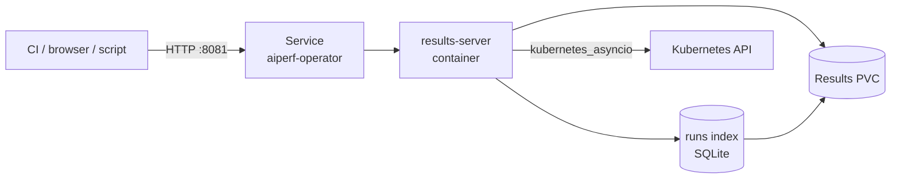

# Results Server API

The AIPerf operator ships a standalone HTTP server (the **results server**) as a sidecar inside the operator pod. It exposes a catalog of `/api/v1/...` endpoints for listing jobs, downloading raw result files, querying the SQLite-backed runs index for analytics, and introspecting live AIPerfJob state.

This reference documents the primary endpoints served by that process; it is not exhaustive. The results server also mounts a **sweeps** router (`/api/v1/sweeps/...` — list, detail, cells, children, epochs, events, logs, artifacts), a **config** router (`/api/v1/config/retention`, `/api/v1/config/features`), additional per-job routes (`/api/v1/jobs/{ns}/{name}/epochs|events|logs`, zip and per-epoch result downloads), and an admin `run/{ns}/{job_id}` index-row route. The source of truth is `src/aiperf/operator/results_server.py` and the routers under `src/aiperf/operator/routers/`.

---

## How to reach the API

The results server listens on `resultsServer.port` (default **`8081`**) inside the operator pod. It is fronted by the operator's Service, not exposed externally by default. Two common access patterns:

### Port-forward via the CLI

```bash
aiperf kube dashboard
```

This opens the browser UI and port-forwards the results server to an ephemeral local port. Pass `--no-browser` to just print the URL, or `--port 8081` to pin a specific local port. The port-forward stays open until Ctrl+C.

### Direct `kubectl port-forward`

```bash
kubectl -n aiperf-system port-forward svc/aiperf-operator 8081:8081
```

The base URL is then `http://localhost:8081`, and all endpoints below are reachable at `http://localhost:8081/api/v1/...`.

### Request topology



The sidecar reads result files from the shared PVC and queries the Kubernetes API (via in-cluster RBAC) for live job/cluster state. Read-only routes have no per-request authentication layer; mutating routes are disabled by default and require explicit bearer-token configuration when enabled. See [Auth / security](#auth--security).

---

## Endpoint reference

| Method | Path | Router | Purpose |
|--------|------|--------|---------|
| GET | `/healthz` | root | Liveness probe |
| GET | `/api/v1/jobs` | jobs | List jobs (live CRs + archived PVC runs) |
| POST | `/api/v1/jobs` | jobs | Create an AIPerfJob CR (mutating route; bearer token required when enabled) |
| GET | `/api/v1/jobs/{namespace}/{name}` | jobs | Single CR + pods + raw status |
| POST | `/api/v1/jobs/{namespace}/{name}/cancel` | jobs | Set `spec.cancel=true` (mutating route; bearer token required when enabled) |
| WS  | `/api/v1/jobs/{namespace}/{name}/ws` | jobs-ws | Live realtime feed (proxied to controller pod) |
| GET | `/api/v1/cluster` | jobs | Node count, GPU total, K8s version |
| GET | `/api/v1/results` | results-files | List every stored job |
| GET | `/api/v1/results/{namespace}/{job_id}` | results-files | List files for one job |
| GET | `/api/v1/results/{namespace}/{job_id}/{filename}` | results-files | Download a result file |
| GET | `/api/v1/jobs/{namespace}/{name}/epochs` | jobs | List historical run epochs for a job |
| GET | `/api/v1/jobs/{namespace}/{name}/events` | jobs | Recent Kubernetes events for the job |
| GET | `/api/v1/jobs/{namespace}/{name}/logs` | jobs | Pod logs (`?pod=`, `?container=`, `?tail_lines=`, `?follow=`) |
| GET | `/api/v1/analytics/leaderboard` | results-analytics | Rank runs by metric |
| GET | `/api/v1/analytics/history` | results-analytics | Metric values over time |
| GET | `/api/v1/analytics/compare` | results-analytics | Side-by-side job compare |
| GET | `/api/v1/analytics/summary/{namespace}/{job_id}` | results-analytics | Full aggregated summary |
| GET | `/api/v1/index` | results-analytics | Fast job index |
| GET | `/admin/index/stats` | admin | Runs-index row counts, DB size, and schema version |
| POST | `/admin/index/rebuild` | admin | Rebuild the runs index from disk — **disabled on the results-server** (mounted `allow_rebuild=False`), returns `503`; the index rebuilds automatically at operator startup |
| GET | `/api/v1/config/{namespace}/{job_id}` | results-analytics | Original CR spec/config |
| GET | `/dashboard/` | dashboard-proxy | httpx reverse-proxy to the optional Plotly Dash sidecar (returns `503` when the sidecar is disabled or unreachable) |

The per-run file-list response includes `per_record_filename` and
`server_metrics_filename` when those artifacts are present. Clients should use
these fields rather than assuming the default filenames: `artifacts.prefix`
changes both names for that particular run.

---

## Meta

### `GET /healthz`

Liveness probe. Always returns `200 OK`.

```bash
curl http://localhost:8081/healthz
```

```json
{"status": "ok"}
```

---

## Jobs

Live state read directly from the Kubernetes API. Every endpoint in this section returns `503 Service Unavailable` if the results server could not initialize its Kubernetes client at startup (e.g. no kubeconfig and not running in-cluster).

### `GET /api/v1/jobs`

List every known AIPerfJob across all namespaces.

**The response is a union**, not just live CRs: `job_union.list_all_jobs` merges live AIPerfJob CRs (`source: "live"`), PVC-only historical runs whose CRs were garbage-collected (`source: "archived"`), and runs present in both (`source: "both"`). Entries are keyed by `(namespace, name)`; overlaps prefer CR values on live fields and backfill historical fields from the PVC.

```bash
curl http://localhost:8081/api/v1/jobs
```

```json
{
  "jobs": [
    {
      "name": "aiperf-bench-7f2a",
      "namespace": "aiperf-benchmarks",
      "phase": "Running",
      "jobId": "aiperf-bench-7f2a",
      "created": "2026-04-22T14:08:11Z"
    }
  ]
}
```

**Status codes**

- `200` — success (possibly empty list)
- `401` / `403` — surfaced verbatim if the sidecar's ServiceAccount lacks RBAC to list `aiperfjobs.aiperf.nvidia.com`
- `503` — Kubernetes client unavailable

### `GET /api/v1/jobs/{namespace}/{name}`

Fetch a single AIPerfJob CR plus its pod roster. Accepts an optional `?epoch=` query parameter to pin the archived half to a specific historical run directory instead of following `latest.txt`.

Archived (PVC-only) jobs have no cluster CR, so the response carries the archived summary with an empty `status` object and an empty `pods` list.

**Path parameters**

| Name | Type | Description |
|------|------|-------------|
| `namespace` | string | Kubernetes namespace of the AIPerfJob CR |
| `name` | string | AIPerfJob CR name |

```bash
curl http://localhost:8081/api/v1/jobs/aiperf-benchmarks/aiperf-bench-7f2a
```

```json
{
  "job": {
    "name": "aiperf-bench-7f2a",
    "namespace": "aiperf-benchmarks",
    "phase": "Running"
  },
  "status": {
    "phase": "Running",
    "conditions": [],
    "liveMetrics": {"requestThroughput": 1842.3}
  },
  "pods": [
    {"name": "aiperf-bench-7f2a-controller-0", "phase": "Running", "ready": true, "restarts": 0},
    {"name": "aiperf-bench-7f2a-worker-0",     "phase": "Running", "ready": true, "restarts": 0}
  ]
}
```

Pods are filtered by the label selector `aiperf.nvidia.com/job-id=<name>`.

**Status codes**

- `200` — success
- `400` — `namespace` or `name` is not a valid RFC 1123 name (rejected before any path join)
- `404` — no AIPerfJob with that name in that namespace and no archived run on the PVC
- `401` / `403` — RBAC denial
- `503` — Kubernetes client unavailable

### `POST /api/v1/jobs/{namespace}/{name}/cancel`

Request cancellation of a running benchmark by patching the CR's `spec.cancel` to `true`.

**This endpoint is asynchronous.** It returns immediately after the patch; the kopf operator observes the change and drives workers to a stopped state over the next several seconds. Poll `GET /api/v1/jobs/{namespace}/{name}` and wait for `status.phase` to become `Cancelled`, `Failed`, or `Succeeded` if you need to confirm termination.

```bash
curl -X POST \
  -H "Authorization: Bearer ${AIPERF_OPERATOR_MUTATING_ROUTES_TOKEN}" \
  http://localhost:8081/api/v1/jobs/aiperf-benchmarks/aiperf-bench-7f2a/cancel
```

```json
{"cancelled": true}
```

**Status codes**

- `200` — patch submitted
- `404` — CR does not exist
- `401` / `403` — RBAC denial
- `409` — concurrent-modification conflict (retry)
- `503` — Kubernetes client unavailable

### `GET /api/v1/cluster`

Best-effort cluster-wide totals for the dashboard header.

```bash
curl http://localhost:8081/api/v1/cluster
```

```json
{
  "nodes": 12,
  "gpus": 96,
  "gpus_used": 40,
  "gpus_free": 56,
  "utilization_percent": 41.7,
  "gpu_nodes": 8,
  "nodes_free": 4,
  "nodes_partial": 3,
  "nodes_full": 1,
  "kubernetes_version": "v1.29.4",
  "cluster_name": "dgx-prod"
}
```

`ClusterResponse` (`operator/routers/jobs_models.py`) carries the full GPU
accounting (`gpus_used`/`gpus_free`/`utilization_percent`), GPU-node breakdown
(`gpu_nodes`, `nodes_free`/`nodes_partial`/`nodes_full`), and an optional
`cluster_name` in addition to the basic `nodes`/`gpus`/`kubernetes_version`.
Both the node list and version query are best-effort: if RBAC is insufficient or the call fails, `kubernetes_version` is reported as `"unknown"` and counts fall back to `0`. The endpoint does not surface errors for these sub-queries.

### `WS /api/v1/jobs/{namespace}/{name}/ws`

Per-job WebSocket proxy. The browser dashboard's per-job detail page uses this to subscribe to the same realtime message stream the controller pod publishes (e.g. `realtime_metrics`, `credit_phase_progress`, `worker_group_stats`), so KPI tiles update at the controller's emit cadence (~1Hz) instead of the page's REST poll interval.

The proxy is transparent: it does not subscribe on the client's behalf. After the WS opens, the browser sends the controller's standard subscribe frame:

```json
{"type": "subscribe", "message_types": ["realtime_metrics"]}
```

…and from then on receives upstream frames verbatim. Implementation: `src/aiperf/operator/routers/jobs_ws.py`.

**Topology**

```mermaid
flowchart LR
    browser[browser<br/>job-detail page] -->|WS /api/v1/jobs/{ns}/{name}/ws| op[operator<br/>results-server]
    op -->|reads CR status.jobSetName| api[Kubernetes API]
    op -->|WS controller-svc:API_SERVICE/ws| ctl[controller pod]
```

The operator looks up the AIPerfJob CR's `status.jobSetName`, derives the controller pod's headless-service DNS via `controller_dns_name(jobset_name, namespace)`, and opens an `aiohttp` WebSocket to `ws://<controller-dns>:<API_SERVICE>/ws`. Two `asyncio` pumps then bridge frames in both directions until either side closes.

**Refusal close codes**

The proxy refuses connections with private-use (`4xxx`) WebSocket close codes so the browser can distinguish causes:

| Code | Meaning |
|---:|---|
| `4503` | Operator's Kubernetes API client is not yet initialized (lifespan startup race). Retrying after a moment is correct. |
| `4404` | The CR has no `status.jobSetName` yet — either the job is still being created or it doesn't exist. The dashboard only opens this WS when `phase === 'running'`, so this should be rare. |
| `4502` | Upstream WS to the controller pod failed (DNS, connection refused, timeout). Typically means the controller pod isn't running. |
| `1000` | Normal close (either side hung up). |


---

## Results (file serving)

All file-serving endpoints read from the shared results PVC mounted at `AIPERF_RESULTS_DIR` (default `/data`). Files are laid out as `<namespace>/<job_id>/<filename>`.

### `GET /api/v1/results`

List every namespace/job directory with at least one stored file.

```bash
curl http://localhost:8081/api/v1/results
```

```json
{
  "jobs": [
    {
      "namespace": "aiperf-benchmarks",
      "job_id": "aiperf-bench-7f2a",
      "file_count": 8,
      "total_size_bytes": 24837211
    }
  ]
}
```

Returns an empty `jobs` list (not a 404) if the PVC base directory doesn't exist yet.

### `GET /api/v1/results/{namespace}/{job_id}`

List all result files for one job.

```bash
curl http://localhost:8081/api/v1/results/aiperf-benchmarks/aiperf-bench-7f2a
```

```json
{
  "namespace": "aiperf-benchmarks",
  "job_id": "aiperf-bench-7f2a",
  "files": [
    {
      "name": "profile_export_aiperf.csv",
      "stored_name": "profile_export_aiperf.csv.zst",
      "size_bytes": 381220,
      "compressed": true,
      "mtime_epoch": 1777472025
    },
    {
      "name": "inputs.json",
      "stored_name": "inputs.json",
      "size_bytes": 4812,
      "compressed": false,
      "mtime_epoch": 1777472025
    }
  ],
  "ready": true
}
```

The `name` field is the **display name** (zstd suffix stripped); use it as the `{filename}` path parameter on the download endpoint. `stored_name` is the actual file on disk.

**Status codes**

- `200` — success
- `400` — `namespace` / `job_id` failed RFC 1123 path-parameter validation (this is how encoded traversal attempts are rejected)
- `404` — no directory `<namespace>/<job_id>/` exists

### `GET /api/v1/results/{namespace}/{job_id}/{filename}`

Download a single result file. The server handles content negotiation automatically based on `Accept-Encoding`.

The lookup tries `<filename>.zst` first, then `<filename>` as-is. `namespace` and `job_id` are validated as RFC 1123 names before any path join (`400` on failure), and the resolved file path must stay under the job directory.

**Content negotiation for stored `.zst` files**

| Client `Accept-Encoding` | Response `Content-Encoding` | Server action |
|--------------------------|-----------------------------|---------------|
| `zstd` (substring match) | `zstd` | Stream raw bytes unmodified |
| `gzip` (no zstd)         | `gzip` | Decompress zstd, recompress as gzip on the fly |
| anything else / absent   | absent | Decompress zstd to identity |

**Content negotiation for stored raw files**

The `common.compression.select_encoding` helper picks the best encoding the client accepts (default `IDENTITY`). `Content-Encoding` is set only if the server is recompressing; otherwise it's omitted.

**Response headers (both paths)**

- `Content-Disposition: attachment; filename="<display-name>"`
- `X-Filename: <display-name>`

```bash
# Native zstd — smallest over the wire
curl -H "Accept-Encoding: zstd" \
  http://localhost:8081/api/v1/results/aiperf-benchmarks/aiperf-bench-7f2a/profile_export_aiperf.csv \
  --output profile.csv.zst

# Let curl transparently decompress gzip
curl --compressed \
  http://localhost:8081/api/v1/results/aiperf-benchmarks/aiperf-bench-7f2a/profile_export_aiperf.csv \
  -o profile.csv
```

**Status codes**

- `200` — stream begins (note: errors mid-stream surface as truncated bodies, not HTTP errors)
- `400` — invalid `namespace` / `job_id` path parameter
- `404` — job directory missing or neither `<filename>` nor `<filename>.zst` found

---

## Analytics (runs-index backed)

All analytics endpoints return `503` with message `"Analytics engine not initialized"` if the results-server lifespan hook has not yet populated the DB handle.

`/analytics/leaderboard`, `/history`, `/compare`, and `/summary` are backed by the `runs_index` SQLite store (`operator/runs_index.py`, exposed through the thin `ResultsDB` facade in `operator/results_db.py`) — flat-column SELECTs against indexed rows, with a zstd-compressed `metrics_json` blob for full-summary access. The earlier JSON-glob read path has been removed. The cold-start cost (one PVC walk) moves to the operator's startup bootstrap; subsequent queries are O(1) regardless of run count, with disk fallback + lazy backfill when the index is stale.

### `GET /api/v1/analytics/leaderboard`

Rank every run by a metric.

**Query parameters**

| Name | Type | Default | Description |
|------|------|---------|-------------|
| `metric` | string | `request_throughput` | Metric to rank by (e.g. `request_throughput`, `request_latency`) |
| `stat` | string | `avg` | Statistic (`avg`, `p50`, `p99`, `min`, `max`) |
| `order` | string | `desc` | Sort order (`asc` or `desc`) |
| `limit` | int | `20` | Max results, `[1, 1000]` |
| `epoch` | string? | `None` | Restrict to one run epoch; `None` = latest per `(namespace, job)` |

```bash
curl "http://localhost:8081/api/v1/analytics/leaderboard?metric=request_throughput&stat=avg&limit=5"
```

```json
{
  "metric": "request_throughput",
  "stat": "avg",
  "order": "desc",
  "entries": [
    {
      "namespace": "aiperf-benchmarks",
      "job_id": "aiperf-bench-7f2a",
      "value": 1842.3,
      "unit": "requests/sec",
      "start_time": "2026-04-22T14:08:11Z",
      "end_time":   "2026-04-22T14:13:45Z",
      "model": "meta-llama/Llama-3.1-70B",
      "endpoint": "http://llama:8000/v1/chat/completions"
    }
  ]
}
```

### `GET /api/v1/analytics/history`

Return metric values over time, optionally filtered by model or endpoint.

**Query parameters**

| Name | Type | Default | Description |
|------|------|---------|-------------|
| `metric` | string | `request_throughput` | Metric to track |
| `stat` | string | `avg` | Statistic |
| `model` | string? | `None` | Filter by model name (substring match) |
| `endpoint` | string? | `None` | Filter by endpoint URL (substring match) |
| `limit` | int | `100` | Max results, `[1, 10000]` |
| `epoch` | string? | `None` | Restrict to one run epoch; `None` = latest per `(namespace, job)` |

```bash
curl "http://localhost:8081/api/v1/analytics/history?metric=request_latency&stat=p99&model=Llama&limit=50"
```

```json
{
  "metric": "request_latency",
  "stat": "p99",
  "entries": [
    {
      "namespace": "aiperf-benchmarks",
      "job_id": "aiperf-bench-7f2a",
      "value": 412.7,
      "unit": "ms",
      "start_time": "2026-04-22T14:08:11Z",
      "model": "meta-llama/Llama-3.1-70B",
      "endpoint": "http://llama:8000/v1/chat/completions"
    }
  ]
}
```

### `GET /api/v1/analytics/compare`

Pull a side-by-side comparison of named jobs across a set of metrics. The response pivots the runs-index rows into `(metric, stat, unit, values={namespace/job_id: value})` entries for the UI.

**Query parameters**

| Name | Type | Default | Description |
|------|------|---------|-------------|
| `jobs` | list[string] | required | Repeat the parameter once per job ID |
| `metrics` | list[string]? | `DEFAULT_COMPARE_METRICS` | Repeat the parameter; defaults to key performance metrics |
| `epoch` | string? | `None` | Restrict every job to one run epoch; `None` = latest per job |

```bash
curl "http://localhost:8081/api/v1/analytics/compare?jobs=aiperf-bench-7f2a&jobs=aiperf-bench-9d4c&metrics=request_throughput&metrics=request_latency"
```

```json
{
  "job_ids": ["aiperf-bench-7f2a", "aiperf-bench-9d4c"],
  "metrics": ["request_throughput", "request_latency"],
  "entries": [
    {
      "metric": "request_throughput",
      "stat": "avg",
      "unit": "requests/sec",
      "values": {
        "aiperf-benchmarks/aiperf-bench-7f2a": 1842.3,
        "aiperf-benchmarks/aiperf-bench-9d4c": 1790.8
      }
    }
  ]
}
```

For each metric, the server emits one entry per stat (`avg`, `p50`, `p99`), plus a `meta` block alongside `entries`. Entries where no job has a value are omitted. Value keys are `namespace/job_id` when a namespace is known, otherwise just the job ID.

Passing a bare job name that matches runs in more than one namespace returns `409` with the ambiguous candidates listed; re-request using `namespace/job` syntax.

### `GET /api/v1/analytics/summary/{namespace}/{job_id}`

Return the full aggregated summary for one job (as a raw JSON object — no Pydantic schema because the shape is driven by the metrics plugin registry).

```bash
curl http://localhost:8081/api/v1/analytics/summary/aiperf-benchmarks/aiperf-bench-7f2a
```

**Status codes**

- `200` — summary found
- `404` — no summary data for that `namespace/job_id`

### `GET /api/v1/index`

Return the full job index used for fast lookups, keyed by `<namespace>/<job_id>`. It is backed by the runs-index SQLite store via `get_db().index_entries()` (`operator/results_db.py` / `operator/runs_index.py`) — there is no `aiperf.operator.job_index` module. The shape is a dict of index rows consumed by the dashboard.

```bash
curl http://localhost:8081/api/v1/index
```

### `GET /api/v1/config/{namespace}/{job_id}`

Return the original CR spec/config used to run a job. The server tries four sources in order (first hit wins) and records which one it used:

1. **Index** (`source: "index"`) — fast path, served from the runs-index SQLite cache.
2. **Standalone spec file** (`source: "file"`) — `<base>/<namespace>/<job_id>/job_spec.json` on the PVC.
3. **Summary extraction** (`source: "summary"`) — pulls `input_config` out of the aggregated summary if the spec wasn't persisted separately.
4. **Live CR** (`source: "cr"`) — fetches `spec` from the apiserver, covering running jobs whose artifacts haven't been persisted yet.

Specs from the first three sources are passed through `_redact_exposed_spec` before being returned.

Accepts an optional `?epoch=` query param (default: follow latest).

```bash
curl http://localhost:8081/api/v1/config/aiperf-benchmarks/aiperf-bench-7f2a
```

```json
{
  "source": "file",
  "spec": {
    "benchmark": {
      "model": ["meta-llama/Llama-3.1-70B"],
      "endpoint": {"url": "http://llama:8000/v1/chat/completions"}
    }
  }
}
```

**Status codes**

- `200` — config found via one of the four sources
- `404` — none of the sources had data for that `namespace/job_id`

---

## Auth / security

Read-only results-server routes do not authenticate individual HTTP requests. Mutating routes are disabled by default and require an explicit bearer token when enabled.

- **Mutating-route gate.** `POST /api/v1/jobs` and `POST /api/v1/jobs/{namespace}/{name}/cancel` return `403` unless `AIPERF_OPERATOR_MUTATING_ROUTES_ENABLED=true` is set on the results-server. When enabled, `AIPERF_OPERATOR_MUTATING_ROUTES_TOKEN` must also be set and callers must send `Authorization: Bearer <token>`; missing or invalid credentials return `401`. Note that `POST /admin/index/rebuild` is separately **disabled** on the results-server (`allow_rebuild=False`) and returns `503` regardless of the token — the index is rebuilt automatically at operator startup.
- **Helm configuration.** The bundled chart does **not** template these variables — there is no `resultsServer.mutatingRoutes` value and no token-secret projection. Set `AIPERF_OPERATOR_MUTATING_ROUTES_ENABLED` and `AIPERF_OPERATOR_MUTATING_ROUTES_TOKEN` directly on the `results-server` container (e.g. via a deployment patch or a customized chart template).
- **First-party callers.** Clients must send the configured token as `Authorization: Bearer <token>` on protected POST requests. Note the rebuild route is mounted with `allow_rebuild=False` on the results-server and always returns `503`; only a fresh bootstrap in the operator's writer process rebuilds the index, so restart the operator pod instead. The browser dashboard does not receive this secret and keeps create/cancel controls read-only/disabled; use `aiperf kube` or `kubectl` for those operations.
- **In-cluster RBAC.** The sidecar uses its ServiceAccount token to call the Kubernetes API. Every `/api/v1/jobs/*` and `/api/v1/cluster` call runs with those permissions, so `list aiperfjobs`, `get pods`, `patch aiperfjobs/spec`, and `list nodes` must be granted in the operator's ClusterRole. RBAC failures surface as `401` / `403` propagated from `kubernetes_asyncio`.
- **Network isolation.** The Service is typically `ClusterIP` only. External access is expected to come via `kubectl port-forward` (trusted user), `aiperf kube dashboard` (trusted user), or an ingress controller. Add a `NetworkPolicy` if your cluster requires stricter pod-to-pod controls.
- **Path traversal.** File-serving endpoints resolve every `{namespace}/{job_id}/{filename}` under the results directory and reject resolved paths that escape the base (`404`). Callers cannot read files outside the PVC.

Do **not** expose the results server directly to the public internet without a proxy that enforces authentication in front of the read-only routes too.
