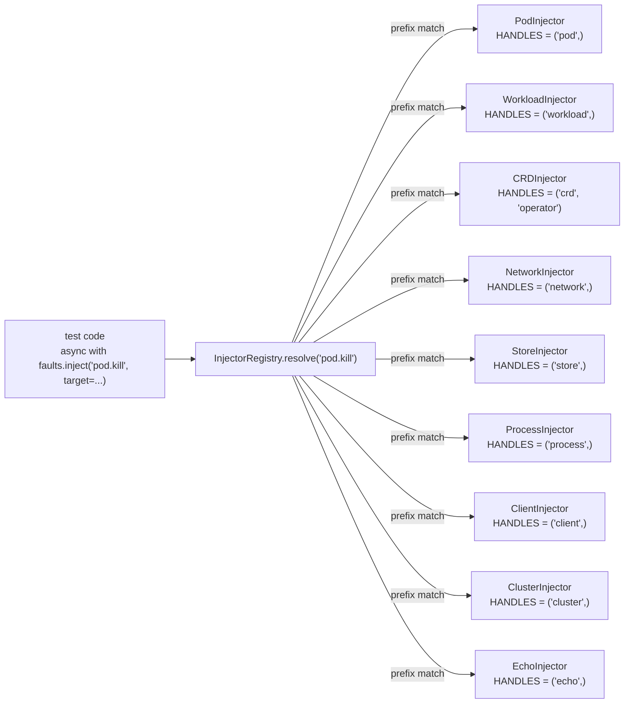

<!--
SPDX-FileCopyrightText: Copyright (c) 2025-2026 NVIDIA CORPORATION & AFFILIATES. All rights reserved.
SPDX-License-Identifier: Apache-2.0
-->

# Chaos Common — Feature Inventory

Reference for the unified chaos-injection module under
[`tests/kubernetes/chaos_common/`](.). Companion to [`README.md`](README.md),
which covers the Cilium-on-kind D704 gate and the chaos-suite invocation
matrix. This document is the source-of-truth capability table for the unified
chaos interface, with a `Status` column tracking what has shipped.

The unified surface wraps two pre-existing systems:

- **System A** — AIPerf chaos primitives under
  [`tests/kubernetes/chaos/`](../chaos/) (`ChaosInjector`,
  `ToxiproxyInjector`, `MockServerInjector`). Frozen — the 23 existing
  AIPerf scenarios continue to use these classes directly.
- **System B / C** — Dynamo-side chaos primitives (System B = existing,
  System C = newer capabilities with mixed shipped, planned, and deferred
  status). Dynamo-side adapters remain, but this checkout does not contain the
  external `chaos_dynamo/` suite.

Status legend:

- shipped — concrete `FaultInjector` lives in `injectors/`, has unit
  coverage in `chaos_common/test_*_injector.py`, and is registered by the
  `chaos_aiperf` conftest.
- planned — slot reserved in the spec; not yet implemented.
- deferred — explicitly out of scope (no current scenario needs it; will
  land when the first consumer arrives).

## 1. Public API surface

| Symbol | Location | Status | Notes |
|---|---|---|---|
| `FaultInjector` ABC | [`base.py`](base.py) | shipped | abstract `inject(spec) -> AppliedFault`; `HANDLES` class tuple for dispatch |
| `AppliedFault` async-cm | [`base.py`](base.py) | shipped | LIFO restore via `AsyncExitStack`; idempotent `restore()` |
| `FaultSpec` dataclass | [`base.py`](base.py) | shipped | `fault_id` + `params` + `target` triple |
| `FaultPreconditionError` | [`base.py`](base.py) | shipped | raised when target is in unexpected state |
| `FaultMechanismError` | [`base.py`](base.py) | shipped | raised when underlying mechanism fails |
| `InjectorRegistry` | [`registry.py`](registry.py) | shipped | explicit `register()`; first matching prefix wins; `async with reg.inject(fault_id, ...)`; LIFO compose |
| `ClusterScopedMutation` + cache | [`recovery.py`](recovery.py) | shipped | on-disk journal of cluster-scoped mutations (`record_mutation`, `load_pending_mutations`, `reverse_cluster_scoped_mutations`, `clear_cache`) so a crashed session's residue can be unwound |
| `--chaos-sweep` flag | [`recovery.py`](recovery.py) | shipped | registered via `pytest_addoption`/`pytest_configure`, re-exported from [`conftest.py`](conftest.py); reverses the journal then `pytest.exit`s |
| `_chaos_namespace_sweeper` fixture | [`conftest.py`](conftest.py) | shipped | opt-in session-teardown force-delete of `aiperf-test-*` / `dynamo-test-*` / `chaos-toxiproxy` namespaces; hard-refuses unless `CHAOS_KUBE_CONTEXT` or `CHAOS_KUBECONFIG` is set |
| `cilium_on_kind_required` mark | [`marks.py`](marks.py) | shipped | `pytest.mark.xfail(strict=True)` gate keyed on `KIND_HAS_CILIUM` env |
| `faults` pytest fixture | [`conftest.py`](conftest.py) | shipped | echo-only function-scoped registry; overridden in `chaos_aiperf/conftest.py` |
| `EchoInjector` | [`injectors/echo.py`](injectors/echo.py) | shipped | `HANDLES = ("echo",)`; records inject/restore calls in memory so registry contracts can be tested with no cluster |

## 2. Capability matrix (from spec § 2)

The unified `fault_id` is the dotted-prefix name the registry dispatches on.
"Owner" indicates which legacy system the capability originated in; the
unified injector wraps that system's mechanism but presents the dotted-name
surface.

### 2a. Pod-level faults (`pod.*`)

| Capability | Owner | `fault_id` | Status |
|---|---|---|---|
| Force-kill pod via `kubectl delete --force --grace-period=0` | both | `pod.kill` | shipped |
| Kill container PID 1 via `kubectl exec` | A | `pod.kill_container` | shipped |
| Kill sibling container by PID via shared-PID-ns | A | `pod.kill_pid` | shipped (requires `shareProcessNamespace: true`) |

### 2b. Workload-level faults (`workload.*`)

| Capability | Owner | `fault_id` | Status |
|---|---|---|---|
| Restart Deployment via `kubectl rollout restart` | A | `workload.restart` | shipped |
| Rollout-restart Deployment (rolling-upgrade alias) | B | `workload.rolling_upgrade` | shipped |
| Scale Deployment to N replicas | A | `workload.scale` | shipped |
| Set env var on Deployment | A | `workload.set_env` | shipped |

### 2c. CRD faults (`crd.*`)

| Capability | Owner | `fault_id` | Status |
|---|---|---|---|
| Delete CR (no wait) | A->generic | `crd.delete` | shipped |
| Rapid double-delete | A | `crd.delete_twice` | shipped |
| Apply invalid CR | A | `crd.apply_invalid` | shipped |
| Patch CR with caller-supplied kubectl patch payload; optionally apply inverse patch on restore | C | `crd.patch` | shipped |
| Stamp arbitrary CR annotation; remove on restore | A | `crd.annotate` | shipped |

### 2d. Operator faults (`operator.*`)

| Capability | Owner | `fault_id` | Status |
|---|---|---|---|
| Kill operator pod | A->generic | `operator.kill` | shipped (served by `CRDInjector`, whose `HANDLES` covers both `crd` and `operator`) |

### 2e. Network faults (`network.*`)

| Capability | Owner | `fault_id` | Status |
|---|---|---|---|
| Toxiproxy latency | A | `network.latency` | shipped |
| Toxiproxy timeout | A | `network.timeout` | shipped |
| Toxiproxy bandwidth | A | `network.bandwidth` | shipped |
| Toxiproxy reset_peer | A | `network.reset_peer` | shipped |
| Toxiproxy slow_close | A | `network.slow_close` | shipped |
| Toxiproxy full proxy disable | A | `network.partition` | shipped |
| Apiserver timeout through TLS-passthrough Toxiproxy route | A | `network.timeout` (target proxy `apiserver`) | shipped |
| Operator -> controller HTTP timeout through Toxiproxy | A | `network.timeout` (target proxy `controller`) | shipped |

### 2f. Store faults (`store.*`)

| Capability | Owner | `fault_id` | Status |
|---|---|---|---|
| etcd pod force-delete | B+C | `store.etcd.kill` | shipped |
| etcd timeout toxic via Toxiproxy | C | `store.etcd.timeout` | shipped |
| etcd bandwidth toxic via Toxiproxy | C | `store.etcd.bandwidth` | shipped |
| etcd partition via full Toxiproxy proxy disable | C | `store.etcd.partition` | shipped |
| NATS pod force-delete | C | `store.nats.kill` | shipped |
| NATS partition via full Toxiproxy proxy disable | C | `store.nats.partition` | shipped |
| NATS slow-close toxic via Toxiproxy | C | `store.nats.slow_close` | shipped |

### 2g. GPU faults (`gpu.*`)

| Capability | Owner | `fault_id` | Status |
|---|---|---|---|
| GPU XID error injection | B | `gpu.xid` | deferred (HTTP POST to per-node DaemonSet; lands with first GPU-XID scenario) |
| VRAM pressure sidecar | C | `gpu.vram_pressure` | deferred |

### 2h. Process faults (`process.*`)

| Capability | Owner | `fault_id` | Status |
|---|---|---|---|
| Send arbitrary signal to a PID inside a named pod container | B | `process.signal` | shipped |
| SIGSTOP a pod-container PID; restore with SIGCONT | B | `process.signal(signal="SIGSTOP")` | shipped |

### 2i. Client faults (`client.*`)

| Capability | Owner | `fault_id` | Status |
|---|---|---|---|
| Force-close client TCP socket mid-request | B | `client.cancel_request` | shipped |
| POST an oversized payload field and capture the rejection response | B | `client.overflow_tokens` | shipped |

### 2j. Cluster faults (`cluster.*`)

| Capability | Owner | `fault_id` | Status |
|---|---|---|---|
| Apply ResourceQuota | A | `cluster.resource_quota` | shipped |
| NetworkPolicy egress blackhole | C | `cluster.network_policy.deny_egress` | shipped (requires NetworkPolicy-enforcing CNI) |
| Remove one verb from a matching Role/ClusterRole rule via JSON patch; re-add on restore | C | `cluster.rbac.revoke` | shipped |

## 3. Fault-domain dispatch

`InjectorRegistry.resolve` iterates registered injectors in registration
order and returns the first whose `HANDLES` tuple matches the `fault_id`
prefix. No matching injector surfaces as a `LookupError` listing every
registered injector and its prefix tuple.

## 4. Test fixture wiring

The `chaos_common/conftest.py` ships an echo-only `faults` fixture (no
real cluster mutations) — sufficient for adapter unit tests under
`chaos_common/test_*_injector.py`. The `chaos_aiperf/conftest.py`
overrides `faults` with a real registry that pre-registers every concrete
injector against a live Kind cluster + AIPerf deployment + Toxiproxy.

Pytest fixture resolution prefers the conftest closest to the test file,
so AIPerf chaos tests pick up the real registry while adapter unit tests stay
hermetic. The external Dynamo D-series registry is absent from this checkout.

## 5. Frozen surface

The following are intentionally NOT migrated to the unified API; they
remain on the legacy classes in [`tests/kubernetes/chaos/`](../chaos/):

- The 23 existing AIPerf chaos scenarios (`tests/kubernetes/chaos/test_chaos_*.py`).
- `ChaosInjector` AIPerf-specific helpers (`stamp_completion_claim`,
  `wait_for_phase`, JobSet/operator selector defaults). Listed in the
  legacy [`tests/kubernetes/chaos/FEATURES.md`](../chaos/FEATURES.md)
  § 2c.

New scenarios should be authored against the unified API. The legacy
classes stay because rewriting 23 passing tests carries no benefit
proportional to the risk of regressing them.
